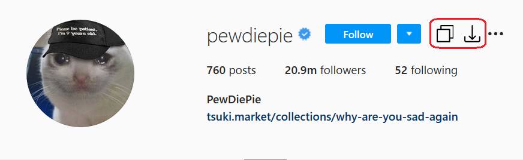
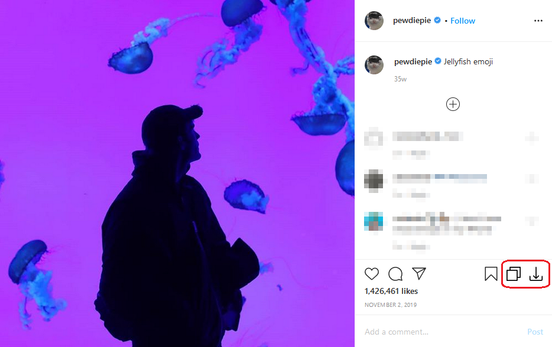
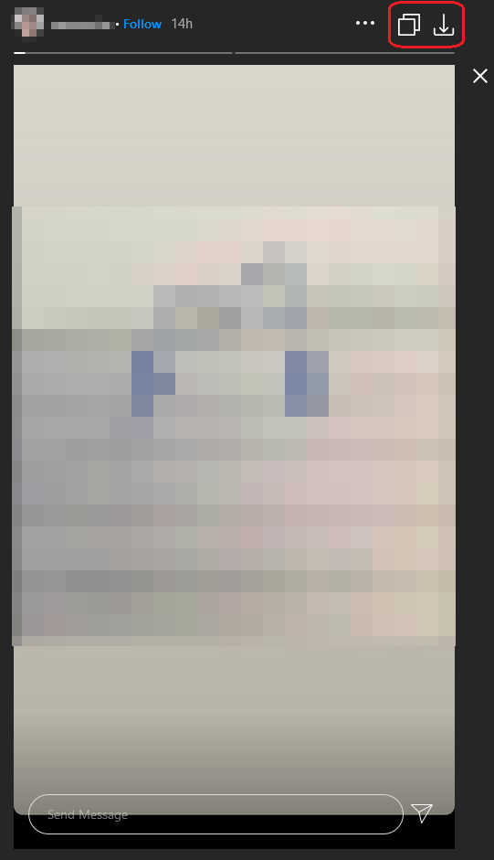

# Instagram Download Button
[Github](https://github.com/y252328/Instagram_Download_Button), [Greasy Fork](https://greasyfork.org/zh-TW/scripts/406535-instagram-download-button), [OpenUserJS](https://openuserjs.org/scripts/y252328/Instagram_Download_Button)

This repository is a JavaScript for Greasemonkey/Tampermonkey. This script will add a download button and open button to your Instagram and you can download or open profile pictures and media in the posts, stories, and highlights by one click.

If any problem, please feel free to contact me in English or Chinese and attach your runtime environment.
> Note: This script only tests on Chrome, Edge, and Firefox with Tampermonkey on Windows 10 1903 64-bit.

## Options
This script can be configured by modifying the following constant variables in the head of this script.
* `attachLink` : attach the link into the button elements if true

## Shortcut Keys
* `Alt` + `i` : Open the media in the new tab
* `Alt` + `k` : Download the media
* `Alt` + `j` : Next media in the multiple media post
* `Alt` + `l` : Previous media in the multiple media post

> The shortcut keys do not work on the Instagram main page currently

 

 

# License
[MIT](https://github.com/y252328/Instagram_Download_Button/blob/master/LICENSE)